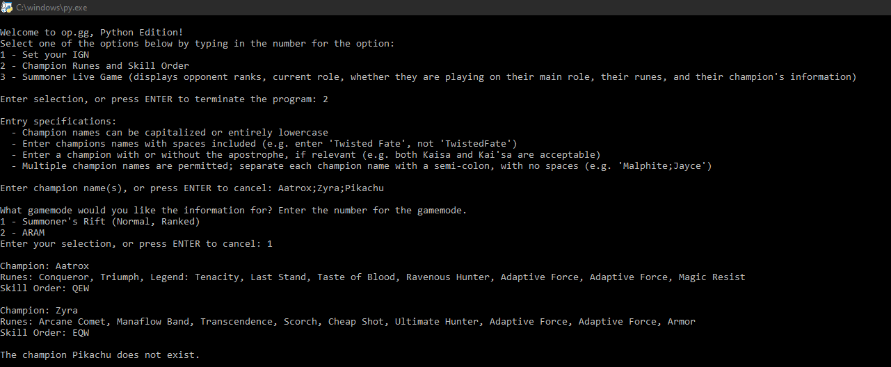
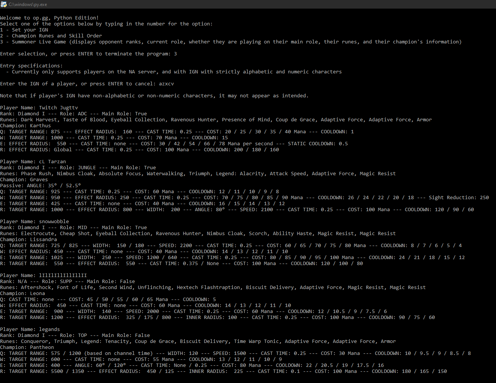

# League of Legends Assistant
Using web-scraping, I created a League of Legends assistant that emulates the functionality of sites and applications like op.gg, u.gg, and blitz.gg.

## Features
This program runs entirely in the Python console, with an interactive UI:

Users can get information such as the recommended runes and skill order for any champion,

or they can search up the ranks and role of their opponents, along with information about each of the opponent's champions.

## Installation and Dependencies
To install this program, download the league_scraper.py file.
In addition, this program has several dependencies, including:
* urllib
* string

Most importantly, this program uses BeautifulSoup library extensively. Downloading the BeautifulSoup 4 library is required to run this program.

This program will store some data locally, such as the most recent League of Legends patch and your IGN, if you choose to save it in the program. Adjusting or moving these files in any way can compromise the functionality of this program.

To reset the program, one can delete all the files. Or, to update all of the champion, rune, and version information, one can just delete the version.txt file, and the program will automatically update all relevant files. To delete one's IGN, one can delete the ign.txt file.
